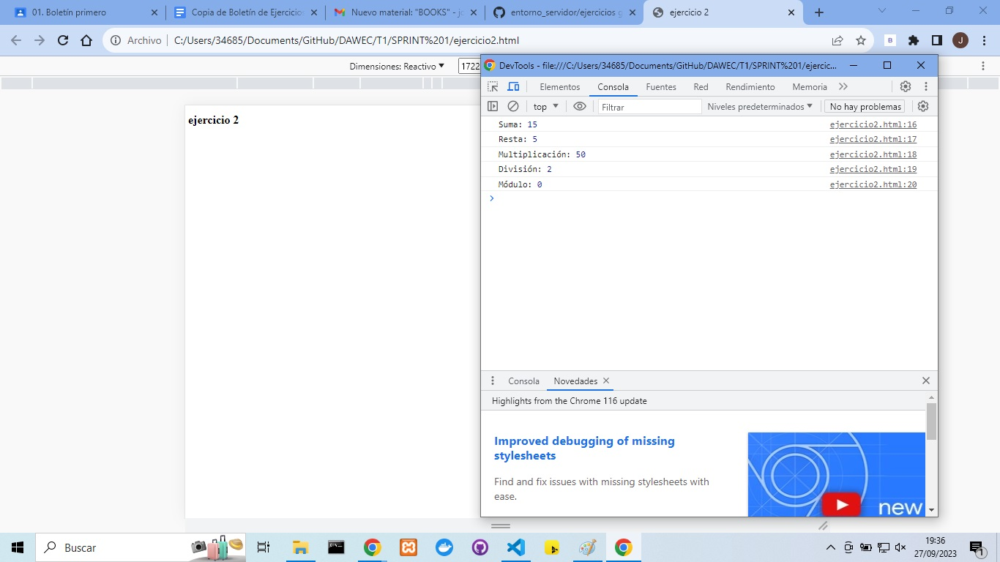
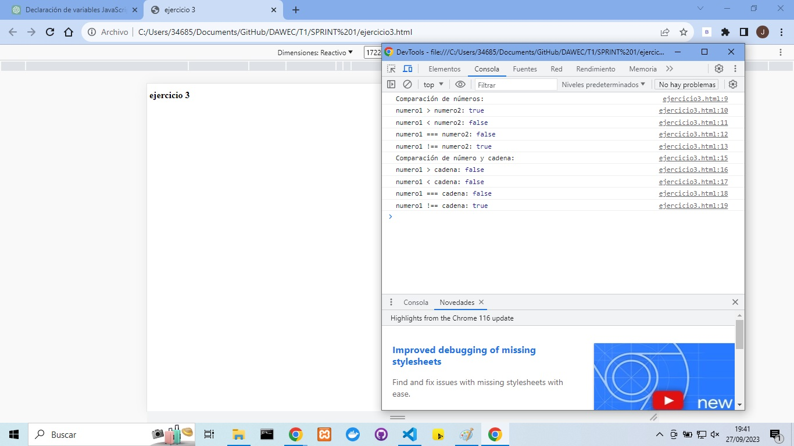
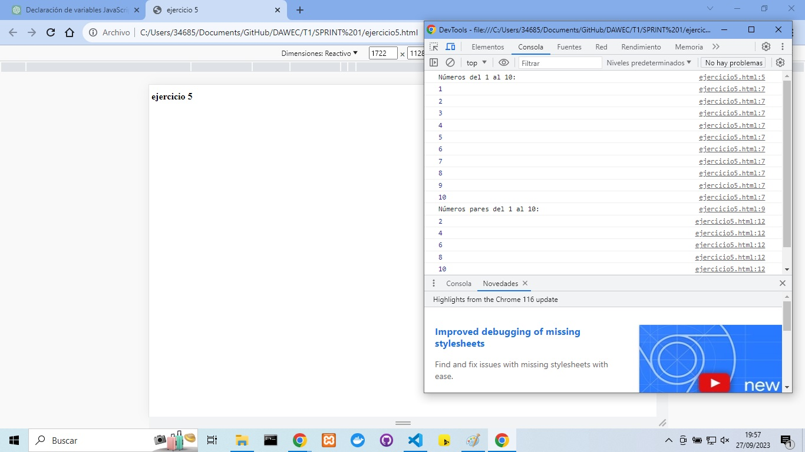

# 🔎 Análisis del Problema
**Ejercicio 1:**

**Objetivo:**
    Declarar variables para diferentes tipos de datos en JavaScript.
Descripción del Problema: Declarar una variable para cada uno de los siguientes tipos de datos: Number, String, Boolean, Object, Null y Undefined.
Requisitos del Problema:
Declarar una variable para cada tipo de dato mencionado.
Asignar un valor a cada variable, representando el tipo de dato correspondiente.
Mostrar el valor de cada variable en la consola usando console.log.

**Ejercicio 2:**

**Objetivo:** Realizar operaciones aritméticas y mostrar los resultados en la consola.
Descripción del Problema: Realizar una serie de operaciones aritméticas (suma, resta, multiplicación, división y módulo) con dos números dados y mostrar los resultados en la consola.
Requisitos del Problema:
Declarar dos variables numéricas, numero1 y numero2.
Realizar las operaciones aritméticas y almacenar los resultados en variables separadas (suma, resta, multiplicacion, division, modulo).
Utilizar console.log para mostrar cada resultado en la consola. 

**Ejercicio 3:**

**Objetivo:** Comprender los operadores de comparación y cómo funcionan.
Descripción del Problema: Comparar tres variables con diferentes valores utilizando operadores de comparación y mostrar los resultados en la consola.
Requisitos del Problema:
Declarar tres variables con diferentes valores (numero1, numero2, cadena).
Comparar numero1 y numero2 usando operadores >, <, ===, y !==.
Comparar numero1 y cadena usando los mismos operadores.
Mostrar los resultados de las comparaciones en la consola.
**Ejercicio 4:**

**Objetivo:** Implementar bucles para repetir acciones múltiples veces.
Descripción del Problema: Escribir un bucle que muestre en la consola los números del 1 al 10, y luego modificar el bucle para mostrar solo los números pares entre 1 y 10.
Requisitos del Problema:
Utilizar un bucle para mostrar números del 1 al 10.
Modificar el bucle para mostrar solo números pares (números divisibles por 2) entre 1 y 10.
Mostrar los números en la consola.
# Diseño
A continuación, se presenta el diseño para cada uno de los ejercicios de manera individual:

Diseño del Ejercicio 1:

Declarar una variable para cada tipo de dato mencionado (Number, String, Boolean, Object, Null y Undefined).
Asignar un valor a cada variable, representando el tipo de dato correspondiente.
Mostrar el valor de cada variable en la consola usando console.log.

Diseño del Ejercicio 2:

Declarar dos variables numéricas, numero1 y numero2.
Realizar las operaciones aritméticas necesarias con estas variables y almacenar los resultados en variables separadas (suma, resta, multiplicacion, division, modulo).
Utilizar console.log para mostrar cada resultado en la consola.

Diseño del Ejercicio 3:

Declarar tres variables con diferentes valores (numero1, numero2, cadena).
Utilizar operadores de comparación para comparar numero1 y numero2 en todas las combinaciones posibles (>, <, ===, !==).
Realizar comparaciones entre numero1 y cadena utilizando los mismos operadores.
Utilizar console.log para mostrar los resultados de las comparaciones en la consola.

Diseño del Ejercicio 4:

Utilizar un bucle for para contar del 1 al 10 y mostrar cada número en la consola.
Modificar el bucle para incluir una condición que verifica si el número es par.
Si el número es par (divisible por 2), mostrarlo en la consola.

# Pruebas:
**Ejercicio 1**

**Ejercicio 2**

**Ejercicio 3**

**Ejercicio 4**

**Ejercicio 5**

