#### **Ejercicio 1: Filtrar Propiedades de un Objeto**

### Descripción del Problema

El problema consiste en escribir una función que tome un objeto y una lista de propiedades y devuelva un nuevo objeto que contenga solo las propiedades indicadas.

### Análisis del Problema

Se proporciona un objeto de entrada (`obj`) y una lista de propiedades (`propiedades`). El objetivo es filtrar el objeto original para que contenga solo las propiedades especificadas en la lista. La función debe verificar si el objeto tiene cada propiedad de la lista y crear un nuevo objeto con esas propiedades.

### Diseño de la Solución

Para resolver este problema, se ha diseñado la función `filtrarPropiedades(obj, propiedades)` que toma dos parámetros: el objeto original y la lista de propiedades a filtrar. La función recorre la lista de propiedades y, para cada propiedad, verifica si existe en el objeto original utilizando `obj.hasOwnProperty(propiedad)`. Si la propiedad existe, se agrega al nuevo objeto de resultado.

### Implementación de la Solución

La implementación de la solución se realiza a través de la función `filtrarPropiedades`:

```javascript
function filtrarPropiedades(obj, propiedades) {
  const resultado = {};

  for (const propiedad of propiedades) {
    if (obj.hasOwnProperty(propiedad)) {
      resultado[propiedad] = obj[propiedad];
    }
  }

  return resultado;
}
</code></div></div></pre>
```

### Pruebas de la Resolución

Para verificar la integridad y el correcto funcionamiento de la implementación, se han proporcionado ejemplos de entrada y se ha mostrado el resultado obtenido.

**Entrada:**

const entrada = { a: 1, b: 2, c: 3, d: 4 };
const props = ["d", "a"];
const resultado = filtrarPropiedades(entrada, props);
`</code></div>``</div></pre>`

**Resultado Esperado:**

<pre><div class="bg-black rounded-md"><div class="flex items-center relative text-gray-200 bg-gray-800 gizmo:dark:bg-token-surface-primary px-4 py-2 text-xs font-sans justify-between rounded-t-md"><span>javascript</span><button class="flex ml-auto gizmo:ml-0 gap-2 items-center"><svg stroke="currentColor" fill="none" stroke-width="2" viewBox="0 0 24 24" stroke-linecap="round" stroke-linejoin="round" class="icon-sm" height="1em" width="1em" xmlns="http://www.w3.org/2000/svg"><path d="M16 4h2a2 2 0 0 1 2 2v14a2 2 0 0 1-2 2H6a2 2 0 0 1-2-2V6a2 2 0 0 1 2-2h2"></path><rect x="8" y="2" width="8" height="4" rx="1" ry="1"></rect></svg>Copy code</button></div><div class="p-4 overflow-y-auto"><code class="!whitespace-pre hljs language-javascript">{
  "d": 4,
  "a": 1
}</code></div></div></pre>

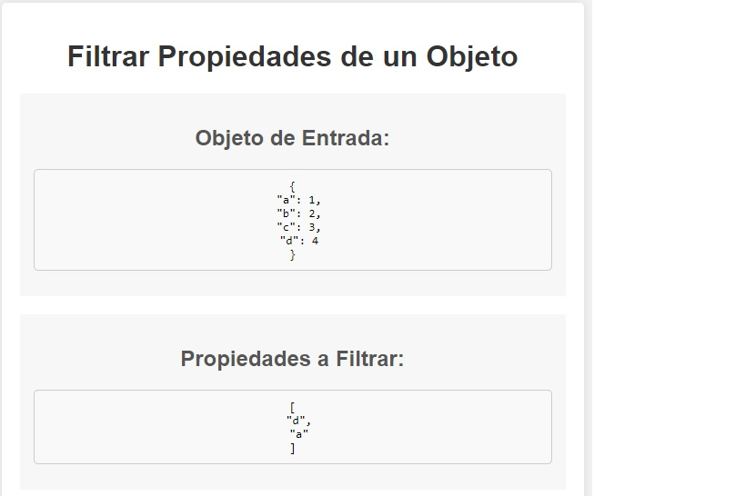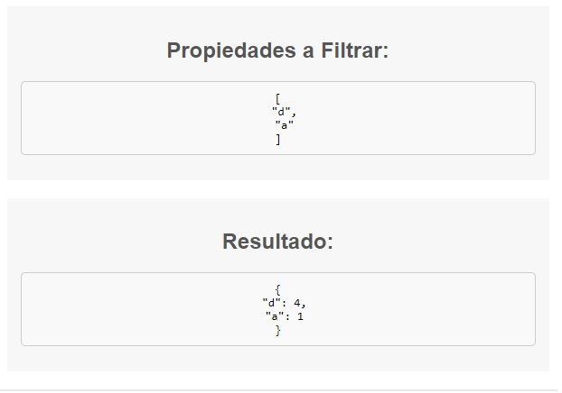


#### **Ejercicio 2: Transposición de Matrices**

### Descripción del Problema

Este ejercicio se enfoca en la transposición de matrices. La tarea consiste en escribir una función que tome una matriz como entrada y devuelva su transposición.

### Análisis del Problema

Se proporciona una matriz (`matriz`) como entrada. El objetivo es crear una nueva matriz que sea la transpuesta de la matriz de entrada. La transposición implica intercambiar filas por columnas.

### Diseño de la Solución

Para resolver este problema, se ha diseñado la función `transponerMatriz(matriz)` que toma una matriz bidimensional como entrada. La función crea una nueva matriz llamada `matrizTranspuesta` con las dimensiones intercambiadas (filas y columnas) y luego llena esta matriz con los valores de la matriz de entrada intercambiando filas por columnas.

### Implementación de la Solución

La implementación de la solución se lleva a cabo en la función `transponerMatriz`. A continuación, se muestra la implementación en JavaScript:

```javascript
function transponerMatriz(matriz) {
  const filas = matriz.length;
  const columnas = matriz[0].length;
  const matrizTranspuesta = new Array(columnas);

  for (let i = 0; i < columnas; i++) {
      matrizTranspuesta[i] = new Array(filas);
  }

  for (let i = 0; i < filas; i++) {
      for (let j = 0; j < columnas; j++) {
          matrizTranspuesta[j][i] = matriz[i][j];
      }
  }

  return matrizTranspuesta;
}
</code></div></div></pre>
```

### Pruebas de la Resolución

Para verificar la implementación, se proporciona una matriz de ejemplo y se muestra la matriz de entrada junto con su transposición.

**Matriz de Ejemplo:**

<pre><div class="bg-black rounded-md"><div class="flex items-center relative text-gray-200 bg-gray-800 gizmo:dark:bg-token-surface-primary px-4 py-2 text-xs font-sans justify-between rounded-t-md"><span>javascript</span><button class="flex ml-auto gizmo:ml-0 gap-2 items-center"><svg stroke="currentColor" fill="none" stroke-width="2" viewBox="0 0 24 24" stroke-linecap="round" stroke-linejoin="round" class="icon-sm" height="1em" width="1em" xmlns="http://www.w3.org/2000/svg"><path d="M16 4h2a2 2 0 0 1 2 2v14a2 2 0 0 1-2 2H6a2 2 0 0 1-2-2V6a2 2 0 0 1 2-2h2"></path><rect x="8" y="2" width="8" height="4" rx="1" ry="1"></rect></svg>Copy code</button></div><div class="p-4 overflow-y-auto"><code class="!whitespace-pre hljs language-javascript">var matriz = [
  [1, 2, 3],
  [4, 5, 6],
  [7, 8, 9]
];
</code></div></div></pre>

**Resultado Esperado:**

<pre><div class="bg-black rounded-md"><div class="flex items-center relative text-gray-200 bg-gray-800 gizmo:dark:bg-token-surface-primary px-4 py-2 text-xs font-sans justify-between rounded-t-md"><span>javascript</span><button class="flex ml-auto gizmo:ml-0 gap-2 items-center"><svg stroke="currentColor" fill="none" stroke-width="2" viewBox="0 0 24 24" stroke-linecap="round" stroke-linejoin="round" class="icon-sm" height="1em" width="1em" xmlns="http://www.w3.org/2000/svg"><path d="M16 4h2a2 2 0 0 1 2 2v14a2 2 0 0 1-2 2H6a2 2 0 0 1-2-2V6a2 2 0 0 1 2-2h2"></path><rect x="8" y="2" width="8" height="4" rx="1" ry="1"></rect></svg>Copy code</button></div><div class="p-4 overflow-y-auto"><code class="!whitespace-pre hljs language-javascript">La matriz de entrada:
[
  [1, 2, 3],
  [4, 5, 6],
  [7, 8, 9]
]

Matriz transpuesta:
[
  [1, 4, 7],
  [2, 5, 8],
  [3, 6, 9]
]</code></div></div></pre>

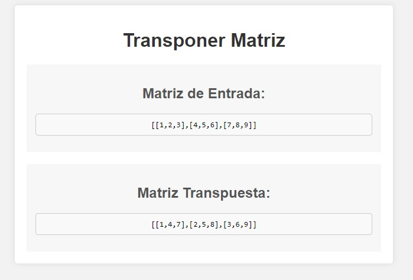


#### **Ejercicio 3: Fusión de Objetos**

### Descripción del Problema

Este ejercicio se centra en la fusión de dos objetos en uno solo. El objetivo es escribir una función que tome dos objetos como entrada y devuelva un nuevo objeto que contenga las propiedades de ambos. En caso de propiedades repetidas, se debe conservar el valor del segundo objeto.

### Análisis del Problema

Se proporcionan dos objetos (`objeto1` y `objeto2`) como entrada. La tarea consiste en fusionar estos objetos en uno solo (`objetoFusionado`). Si hay propiedades con el mismo nombre en ambos objetos, se debe conservar el valor del segundo objeto (`objeto2`).

### Diseño de la Solución

Para resolver este problema, se ha diseñado la función `fusionarObjetos(obj1, obj2)` que toma dos objetos como entrada. La función crea un nuevo objeto (`resultado`) utilizando el operador de propagación (`...`) para combinar las propiedades de ambos objetos. Esto permite que las propiedades del segundo objeto sobrescriban las del primero en caso de duplicados.

### Implementación de la Solución

La implementación de la solución se lleva a cabo en la función `fusionarObjetos`. A continuación, se muestra la implementación en JavaScript:

```javascript
function fusionarObjetos(obj1, obj2) {
  const resultado = { ...obj1, ...obj2 };
  return resultado;
}
</code></div></div></pre>
```

### Pruebas de la Resolución

Se proporcionan dos objetos de ejemplo (`objeto1` y `objeto2`) que se fusionan utilizando la función `fusionarObjetos`. Los resultados se muestran en una tabla HTML para visualizar las propiedades del objeto fusionado.

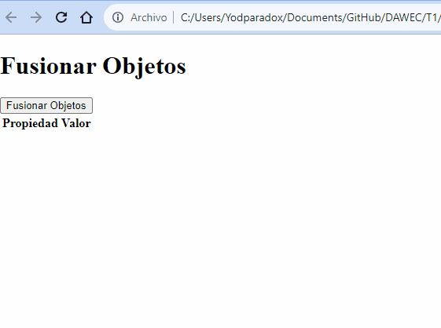

#### **Ejercicio 4: Cadena Más Larga en un Array de Cadenas**

### Descripción del Problema

En este ejercicio, el objetivo es escribir una función que, dado un array de cadenas, encuentre y devuelva la cadena más larga y su longitud. La función debe manejar casos especiales, como un array vacío.

### Análisis del Problema

Se proporciona un array de cadenas (`arr`) como entrada. La función `cadenaMasLarga(arr)` busca la cadena más larga en el array y devuelve un objeto con dos propiedades: `cadena` (la cadena más larga) y `longitud` (la longitud de la cadena más larga).

### Diseño de la Solución

La función comienza manejando un caso especial: si el array está vacío, devuelve un objeto con una cadena nula y longitud 0. Luego, inicializa una cadena (`cadenaMasLarga`) y una longitud (`longitudMasLarga`) con la primera cadena del array.

A continuación, se itera a través del array y se compara la longitud de cada cadena con `longitudMasLarga`. Si se encuentra una cadena más larga, se actualiza `cadenaMasLarga` y `longitudMasLarga`.

### Implementación de la Solución

La implementación de la función se muestra en JavaScript a continuación:

```javascript
function cadenaMasLarga(arr) {
    if (arr.length === 0) {
        // Manejo de caso especial: el array está vacío
        return { cadena: null, longitud: 0 };
    }

    let cadenaMasLarga = arr[0]; // Inicializamos con la primera cadena
    let longitudMasLarga = cadenaMasLarga.length;

    for (let i = 1; i < arr.length; i++) {
        const cadenaActual = arr[i];
        if (cadenaActual.length > longitudMasLarga) {
            // Si la cadena actual es más larga, actualizamos la cadena y su longitud
            cadenaMasLarga = cadenaActual;
            longitudMasLarga = cadenaActual.length;
        }
    }

    return { cadena: cadenaMasLarga, longitud: longitudMasLarga };
}
</code></div></div></pre>
```

### Pruebas de la Resolución

Se proporciona un ejemplo de uso donde se crea un array de cadenas (`arrayDeCadenas`) y se utiliza la función `cadenaMasLarga` para encontrar la cadena más larga. Los resultados se muestran en la página HTML.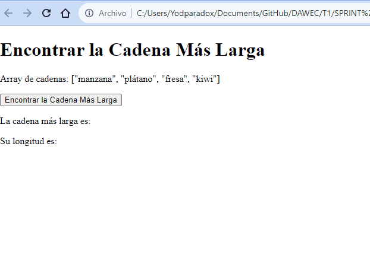


## Ejercicio 5: Ordenamiento Interactivo de Tabla de Personas

**Descripción del Problema**

En este ejercicio, se presenta una tabla de personas con las columnas "Nombre", "Edad", "DNI", "Tiene/No tiene hijos" y "Fecha de nacimiento". El objetivo es escribir una función que permita ordenar la tabla por cualquiera de estas columnas. Además, la columna "Fecha de nacimiento" debe tener el formato DD/MM/AAAA.

**Análisis del Problema**

Se proporciona una función llamada `ordenarTabla(columna)` que toma como argumento la columna por la cual se debe ordenar la tabla. La función se encarga de ordenar las filas de la tabla según la columna seleccionada. Se implementa una lógica para cambiar entre orden ascendente y descendente al hacer clic en la columna.

**Diseño de la Solución**

La función `ordenarTabla` comienza por obtener la tabla y las filas de la tabla. Luego, se convierten las filas en un array y se determina si el orden es ascendente o descendente. A continuación, se realiza la clasificación de las filas según el valor de la columna seleccionada. Para la columna "Fecha de nacimiento," se convierten las fechas al formato "YYYY/MM/DD" para la comparación.

**Implementación de la Solución**

La implementación se muestra en JavaScript y se relaciona con una tabla de ejemplo. Se crean filas y celdas para la tabla con datos de personas. Además, se agrega la lógica para ordenar la tabla cuando se hace clic en una columna.


```html
<!DOCTYPE html>
<html>
<head>
    <style>
        /* Estilos para la tabla */
        table {
            border-collapse: collapse;
            width: 100%;
        }

        table, th, td {
            border: 1px solid black;
        }

        th, td {
            padding: 8px;
            text-align: left;
        }

        /* Estilos para las filas impares */
        tr:nth-child(odd) {
            background-color: #f2f2f2;
        }

        /* Estilos para las celdas de fecha de nacimiento */
        td[data-column="Fecha de nacimiento"] {
            font-family: monospace;
        }

        /* Estilos para las celdas de DNI */
        td[data-column="DNI"] {
            font-family: monospace;
        }
    </style>
</head>
<body>
    <h2>Tabla de Personas</h2>

    <table id="tablaPersonas">
        <thead>
            <tr>
                <th onclick="ordenarTabla('Nombre')">Nombre</th>
                <th onclick="ordenarTabla('Edad')">Edad</th>
                <th onclick="ordenarTabla('DNI')">DNI</th>
                <th onclick="ordenarTabla('Tiene/No tiene hijos')">Tiene/No tiene hijos</th>
                <th onclick="ordenarTabla('Fecha de nacimiento')">Fecha de nacimiento</th>
            </tr>
        </thead>
        <tbody>
            <!-- Filas de la tabla generadas dinámicamente -->
        </tbody>
    </table>

    <script>
        // Datos de la tabla
        var tabla = [
            {
                Nombre: "Ana",
                Edad: 25,
                DNI: "45678912B",
                "Tiene/No tiene hijos": "Tiene",
                "Fecha de nacimiento": "12/05/1998"
            },
            {
                Nombre: "Carlos",
                Edad: 30,
                DNI: "12345678A",
                "Tiene/No tiene hijos": "No tiene",
                "Fecha de nacimiento": "05/02/1993"
            },
            {
                Nombre: "Berta",
                Edad: 28,
                DNI: "98765432C",
                "Tiene/No tiene hijos": "Tiene",
                "Fecha de nacimiento": "20/03/1995"
            },
            {
                Nombre: "David",
                Edad: 31,
                DNI: "11223344D",
                "Tiene/No tiene hijos": "Tiene",
                "Fecha de nacimiento": "18/08/1992"
            },
            // ... Agregar más datos si es necesario
        ];

        var tbody = document.querySelector("tbody");
        for (var i = 0; i < tabla.length; i++) {
            var fila = document.createElement("tr");
            for (var clave in tabla[i]) {
                var celda = document.createElement("td");
                celda.setAttribute("data-column", clave);
                celda.textContent = tabla[i][clave];
                fila.appendChild(celda);
            }
            tbody.appendChild(fila);
        }

        function ordenarTabla(columna) {
            var tabla = document.getElementById("tablaPersonas");
            var filas = tabla.getElementsByTagName("tbody")[0].getElementsByTagName("tr");

            var filasArray = Array.from(filas);

            var ordenAscendente = tabla.getAttribute("data-orden") === "ascendente";

            tabla.setAttribute("data-orden", ordenAscendente ? "descendente" : "ascendente");

            filasArray.sort(function(a, b) {
                var valorA = a.querySelector("td[data-column='" + columna + "']").textContent;
                var valorB = b.querySelector("td[data-column='" + columna + "']").textContent;

                if (columna === "Fecha de nacimiento") {
                    // Convertir las fechas al formato "YYYY/MM/DD" para la comparación
                    valorA = valorA.split("/").reverse().join("/");
                    valorB = valorB.split("/").reverse().join("/");
                }

                if (ordenAscendente) {
                    return valorA.localeCompare(valorB);
                } else {
                    return valorB.localeCompare(valorA);
                }
            });

            var tbody = tabla.getElementsByTagName("tbody")[0];
            filasArray.forEach(function(fila) {
                tbody.appendChild(fila);
            });
        }
    </script>
</body>
</html>
```

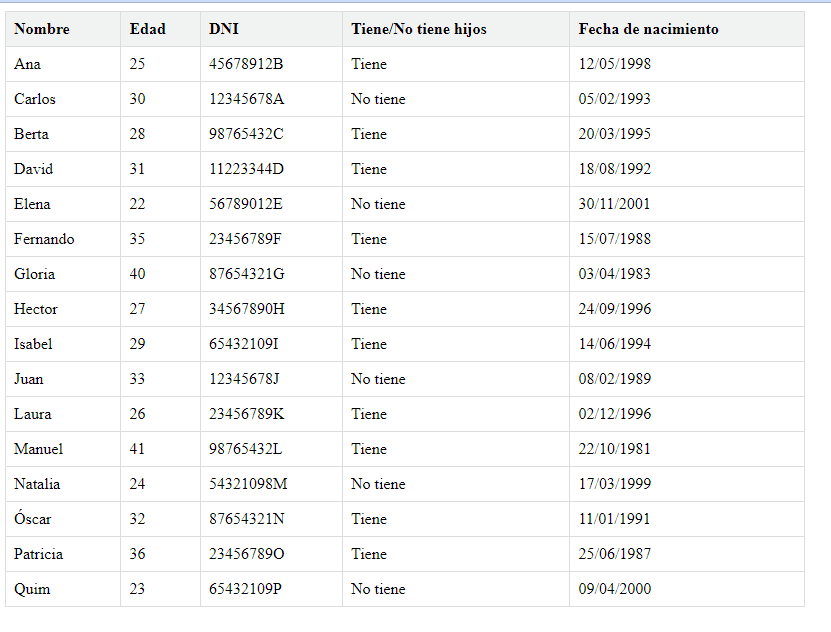

## Ejercicio 6: Análisis y Transformación Avanzada de Datos

**Descripción del Problema**

Dado un conjunto de datos en forma de array con información sobre estudiantes, sus calificaciones en diferentes asignaturas y detalles adicionales, implementa funciones para analizar, filtrar y transformar estos datos.

**Parte 1: Estudiantes Destacados por Asignatura**

Crea una función que, dada una asignatura, retorne los 3 estudiantes con las mejores notas en esa asignatura.

**Parte 2: Asignatura con Menor Rendimiento**

Diseña una función que identifique la asignatura en la que los estudiantes tienen, en promedio, la menor calificación.

**Parte 3: Mejora de Notas para Estudiantes con Beca**

Escribe una función que aumente todas las notas de los estudiantes con beca en un 10% (sin superar el máximo de 10).

**Parte 4: Filtrado por Ciudad y Asignatura**

Crea una función que, dada una ciudad y una asignatura, retorne la lista de estudiantes de esa ciudad ordenados descendentemente por la nota de la asignatura dada.

**Parte 5: Estudiantes Sin Beca por Ciudad**

Escribe una función que, dada una ciudad, retorne la cantidad de estudiantes que no tienen beca en esa ciudad.

**Parte 6: Promedio de Edad de Estudiantes con Beca**

Diseña una función que calcule el promedio de edad de los estudiantes que tienen beca.

**Parte 7: Mejores Estudiantes en Total**

Crea una función que devuelva un array con los 2 estudiantes que tengan el mayor promedio general entre todas las asignaturas.

**Parte 8: Estudiantes con Todas las Materias Aprobadas**

Diseña una función que retorne un array con los nombres de los estudiantes que hayan aprobado todas las materias (considera aprobado con una calificación mayor o igual a 5).


```javascript
const estudiantes = [
    { nombre: "Juan", ciudad: "Madrid", beca: false, edad: 21, calificaciones: { matematicas: 5, fisica: 7, historia: 6 } },
    { nombre: "Ana", ciudad: "Barcelona", beca: true, edad: 20, calificaciones: { matematicas: 9, fisica: 6, historia: 8 } },
    { nombre: "Pedro", ciudad: "Madrid", beca: false, edad: 23, calificaciones: { matematicas: 4, fisica: 5, historia: 7 } },
    { nombre: "Maria", ciudad: "Sevilla", beca: true, edad: 19, calificaciones: { matematicas: 8, fisica: 7, historia: 9 } },
    { nombre: "Jose", ciudad: "Madrid", beca: false, edad: 22, calificaciones: { matematicas: 6, fisica: 7, historia: 5 } },
    { nombre: "Isabel", ciudad: "Valencia", beca: true, edad: 20, calificaciones: { matematicas: 5, fisica: 8, historia: 7 } },
    { nombre: "David", ciudad: "Bilbao", beca: false, edad: 24, calificaciones: { matematicas: 7, fisica: 6, historia: 8 } },
    { nombre: "Laura", ciudad: "Barcelona", beca: true, edad: 19, calificaciones: { matematicas: 6, fisica: 8, historia: 7 } },
    { nombre: "Miguel", ciudad: "Sevilla", beca: false, edad: 21, calificaciones: { matematicas: 7, fisica: 7, historia: 8 } },
    { nombre: "Sara", ciudad: "Madrid", beca: true, edad: 20, calificaciones: { matematicas: 6, fisica: 5, historia: 9 } },
    { nombre: "Daniela", ciudad: "Valencia", beca: false, edad: 22, calificaciones: { matematicas: 8, fisica: 9, historia: 6 } },
    { nombre: "Alberto", ciudad: "Bilbao", beca: true, edad: 23, calificaciones: { matematicas: 5, fisica: 8, historia: 6 } },
    { nombre: "Gabriel", ciudad: "Sevilla", beca: false, edad: 19, calificaciones: { matematicas: 8, fisica: 5, historia: 7 } },
    { nombre: "Carmen", ciudad: "Barcelona", beca: true, edad: 24, calificaciones: { matematicas: 9, fisica: 9, historia: 9 } },
    { nombre: "Roberto", ciudad: "Madrid", beca: false, edad: 20, calificaciones: { matematicas: 4, fisica: 5, historia: 5 } },
    { nombre: "Carolina", ciudad: "Valencia", beca: true, edad: 22, calificaciones: { matematicas: 5, fisica: 7, historia: 6 } },
    { nombre: "Alejandro", ciudad: "Bilbao", beca: false, edad: 23, calificaciones: { matematicas: 9, fisica: 8, historia: 8 } },
    { nombre: "Lucia", ciudad: "Barcelona", beca: true, edad: 21, calificaciones: { matematicas: 7, fisica: 7, historia: 7 } },
    { nombre: "Ricardo", ciudad: "Sevilla", beca: false, edad: 19, calificaciones: { matematicas: 6, fisica: 5, historia: 6 } },
    { nombre: "Marina", ciudad: "Madrid", beca: true, edad: 20, calificaciones: { matematicas: 5, fisica: 9, historia: 8 } }
];

function estudiantesDestacadosPorAsignatura(asignatura) {
    // Filtrar y ordenar a los estudiantes por las notas de la asignatura
    const estudiantesFiltrados = estudiantes.filter(estudiante => asignatura in estudiante.calificaciones);
  
    estudiantesFiltrados.sort((a, b) => b.calificaciones[asignatura] - a.calificaciones[asignatura]);

    // Tomar los 3 primeros estudiantes con las mejores notas
    const mejoresEstudiantes = estudiantesFiltrados.slice(0, 3);

    // Devolver los resultados
    return mejoresEstudiantes;
}
function mostrarMejoresEstudiantesMatematicas() {
    const asignatura = "matematicas";
    const mejoresEstudiantesMatematicas = estudiantesDestacadosPorAsignatura(asignatura);
    console.log("Mejores estudiantes en Matemáticas:", mejoresEstudiantesMatematicas);
}
function mostrarMejoresEstudiantesFisica() {
    const asignatura = "fisica";
    const mejoresEstudiantesFisica = estudiantesDestacadosPorAsignatura(asignatura);
    console.log("Mejores estudiantes en Física:", mejoresEstudiantesFisica);
}
function mostrarMejorEstudianteHistoria() {
    const asignatura = "historia";
    const mejoresEstudiantesHistoria = estudiantesDestacadosPorAsignatura(asignatura);
    console.log("Mejor estudiante en Historia:", mejoresEstudiantesHistoria[0]);
}
function mostrarMejoresEstudiantesBeca() {
    const estudiantesConBeca = estudiantes.filter(estudiante => estudiante.beca);
    const mejoresEstudiantesBeca = mejoresEstudiantes(estudiantesConBeca);
    console.log("Mejores estudiantes con beca:", mejoresEstudiantesBeca);
}
function mostrarEstudiantesMadridMatematicas() {
    const ciudad = "Madrid";
    const asignatura = "matematicas";
    const estudiantesDestacados = filtrarPorCiudadYAsignatura(ciudad, asignatura);
    console.log("Estudiantes de Madrid destacados en Matemáticas:", estudiantesDestacados);
}
function asignaturaMenorRendimiento() {
    // Crear un objeto para almacenar el promedio de calificaciones por asignatura
    const promediosPorAsignatura = {};

    // Calcular el promedio de calificaciones por asignatura
    for (const estudiante of estudiantes) {
        for (const asignatura in estudiante.calificaciones) {
            if (!promediosPorAsignatura[asignatura]) {
                promediosPorAsignatura[asignatura] = [];
            }
            promediosPorAsignatura[asignatura].push(estudiante.calificaciones[asignatura]);
        }
    }

    // Calcular el promedio de cada asignatura
    for (const asignatura in promediosPorAsignatura) {
        const calificaciones = promediosPorAsignatura[asignatura];
        const promedio = calificaciones.reduce((acc, nota) => acc + nota, 0) / calificaciones.length;
        promediosPorAsignatura[asignatura] = promedio;
    }

    // Encontrar la asignatura con el promedio más bajo
    let asignaturaMinRendimiento = null;
    let minPromedio = Infinity;

    for (const asignatura in promediosPorAsignatura) {
        if (promediosPorAsignatura[asignatura] < minPromedio) {
            minPromedio = promediosPorAsignatura[asignatura];
            asignaturaMinRendimiento = asignatura;
        }
    }

    return asignaturaMinRendimiento;
}

function mejoraNotasBeca() {
    for (const estudiante of estudiantes) {
        if (estudiante.beca) {
            for (const asignatura in estudiante.calificaciones) {
                // Aumentar la calificación en un 10%, sin superar 10
                estudiante.calificaciones[asignatura] = Math.min(10, estudiante.calificaciones[asignatura] * 1.1);
            }
        }
    }
}

function filtrarPorCiudadYAsignatura(ciudad, asignatura) {
    // Filtrar estudiantes por ciudad
    const estudiantesCiudad = estudiantes.filter(estudiante => estudiante.ciudad === ciudad);

    // Filtrar estudiantes que tengan la asignatura y crear un array con sus calificaciones en esa asignatura
    const estudiantesConAsignatura = estudiantesCiudad.filter(estudiante => asignatura in estudiante.calificaciones);

    // Ordenar estudiantes por la nota en la asignatura de forma descendente
    estudiantesConAsignatura.sort((a, b) => b.calificaciones[asignatura] - a.calificaciones[asignatura]);

    // Devolver la lista de estudiantes
    return estudiantesConAsignatura;
}

function estudiantesSinBecaPorCiudad(ciudad) {
    // Filtrar estudiantes por ciudad y sin beca, y contar su número
    const estudiantesCiudadSinBeca = estudiantes.filter(estudiante => estudiante.ciudad === ciudad && !estudiante.beca);
    const cantidadEstudiantesSinBeca = estudiantesCiudadSinBeca.length;
  
    return cantidadEstudiantesSinBeca;
}

function promedioEdadEstudiantesConBeca() {
    // Filtrar estudiantes con beca y calcular el promedio de edad
    const estudiantesConBeca = estudiantes.filter(estudiante => estudiante.beca);
  
    if (estudiantesConBeca.length === 0) {
        return 0; // En caso de que no haya estudiantes con beca, devolver 0.
    }

    const sumaEdades = estudiantesConBeca.reduce((total, estudiante) => total + estudiante.edad, 0);
    const promedio = sumaEdades / estudiantesConBeca.length;
  
    return promedio;
}

function mejoresEstudiantes() {
    // Clonar el array de estudiantes para no modificar el original
    const estudiantesClon = [...estudiantes];

    // Calcular el promedio general para cada estudiante
    estudiantesClon.forEach(estudiante => {
        const calificaciones = Object.values(estudiante.calificaciones);
        const promedioGeneral = calificaciones.reduce((acc, nota) => acc + nota, 0) / calificaciones.length;
        estudiante.promedioGeneral = promedioGeneral;
    });

    // Ordenar estudiantes por promedio general de forma descendente
    estudiantesClon.sort((a, b) => b.promedioGeneral - a.promedioGeneral);

    // Tomar los 2 primeros estudiantes con el mejor promedio general
    const mejoresDosEstudiantes = estudiantesClon.slice(0, 2);

    // Devolver los resultados
    return mejoresDosEstudiantes;
}

function estudiantesAprobados() {
    // Filtrar estudiantes que han aprobado todas las materias (calificación mayor o igual a 5)
    const estudiantesAprobados = estudiantes.filter(estudiante => {
        const calificaciones = Object.values(estudiante.calificaciones);
        return calificaciones.every(nota => nota >= 5);
    });

    // Obtener los nombres de los estudiantes aprobados
    const nombresAprobados = estudiantesAprobados.map(estudiante => estudiante.nombre);

    return nombresAprobados;
}
function mostrarMensajePrompt(asignatura) {
    const mensaje = `Ingresa el valor de filtrado para la asignatura ${asignatura}:`;
    const valorFiltrado = prompt(mensaje);
    if (valorFiltrado !== null) {
        const resultado = estudiantesDestacadosPorAsignatura(asignatura, parseFloat(valorFiltrado));
        console.log(resultado);
    }
}
```

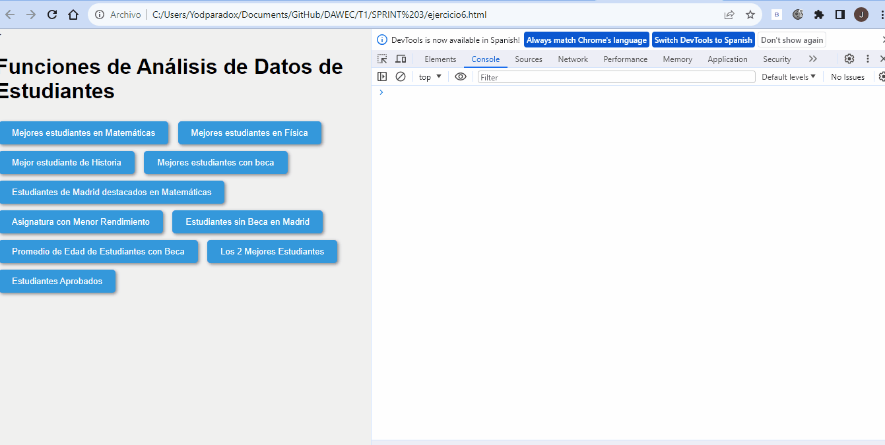

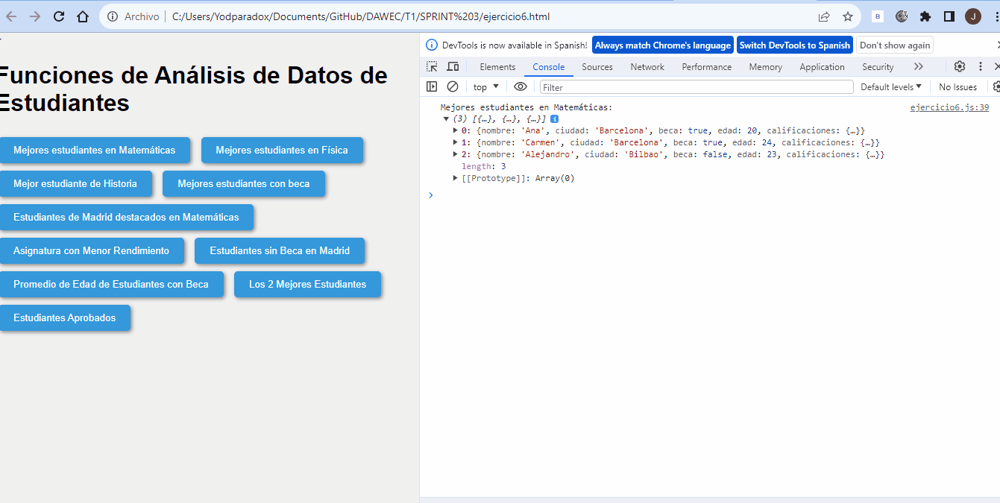

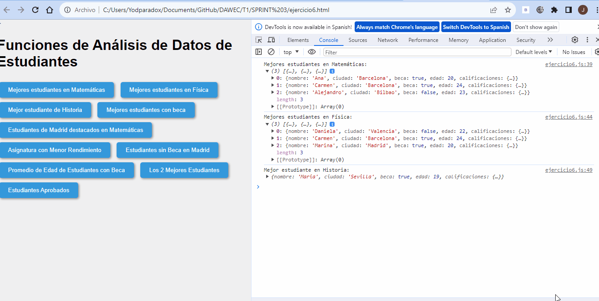

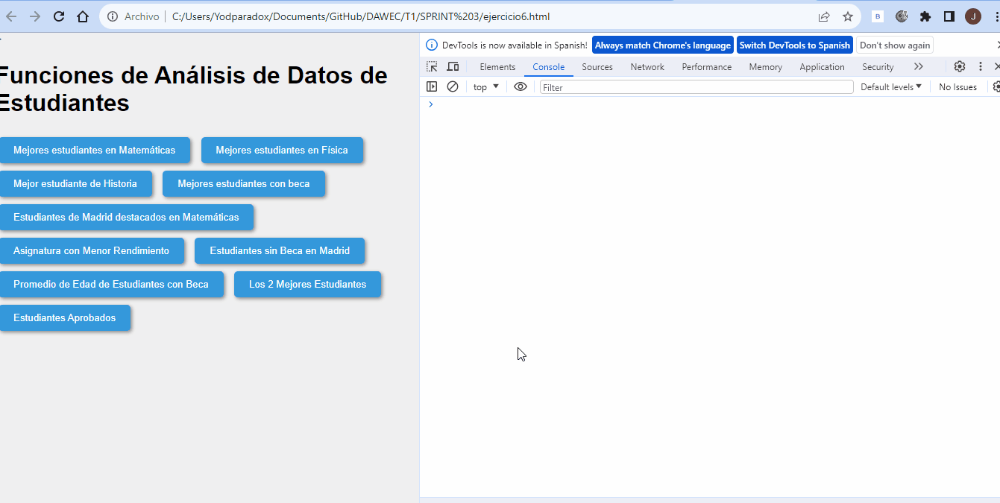

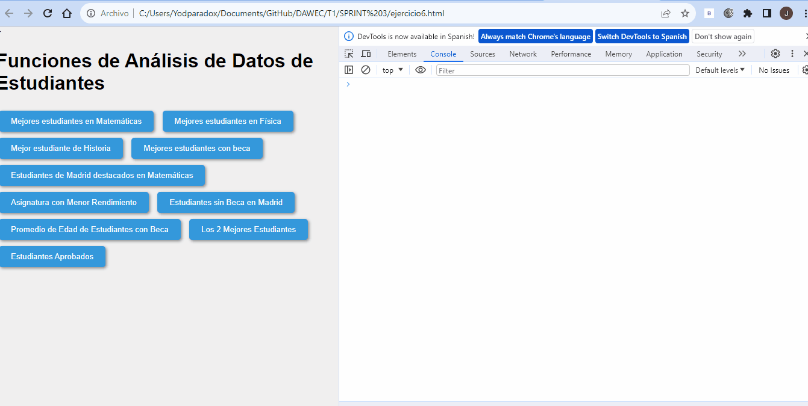


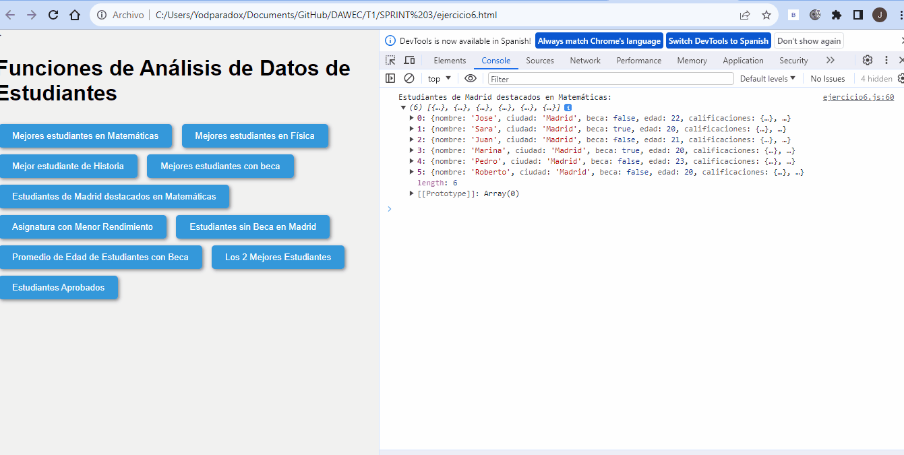
