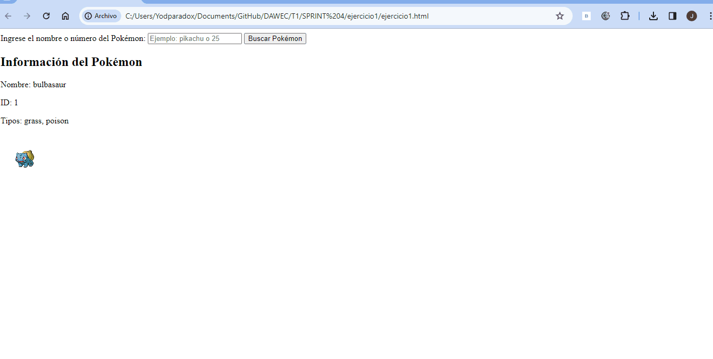

## Ejercicio 1: Información Básica del Pokémon

**Análisis del problema:**

- Se propone obtener información básica de un Pokémon mediante la PokeAPI.
- La tarea es clara: realizar una solicitud a la PokeAPI para obtener datos como el nombre, id, tipos y una imagen del Pokémon.

**Diseño de la propuesta de solución:**

- Utilización de la PokeAPI para obtener datos de un Pokémon por su nombre.
- Presentación de la información de manera clara en la interfaz de usuario.
- Manejo de errores en caso de que el Pokémon no exista.

## Ejercicio 2: Comparativa de Pokémon

**Análisis del problema:**

- Obtener datos de dos Pokémon seleccionados por el usuario.
- Realizar una comparativa de sus estadísticas base para determinar cuál tiene mejores estadísticas generales.

**Diseño de la propuesta de solución:**

- Interacción con el usuario para elegir dos Pokémon.
- Obtención de datos de ambos Pokémon.
- Presentación de resultados en una tabla comparativa.

## Ejercicio 3: Evoluciones y Habilidades

**Análisis del problema:**

- Encontrar la cadena de evolución completa de un Pokémon.
- Listar formas evolutivas y habilidades, con opción para ver más detalles de cada habilidad.

**Diseño de la propuesta de solución:**

- Uso de la PokeAPI para obtener la cadena de evolución y detalles de habilidades.
- Presentación de información en una interfaz amigable.
- Implementación de un botón para ver más detalles de las habilidades.

## Ejercicio 4: Explorador de Películas

**Análisis del problema:**

- Crear una aplicación web para explorar películas basándose en criterios como género, utilizando la API The Movie DB (TMDB API).
- Interfaz de búsqueda y presentación de resultados de manera amigable.

**Diseño de la propuesta de solución:**

- Utilización de la TMDB API para realizar búsquedas y obtener detalles de películas.
- Diseño de una interfaz con paginación y opciones de filtrado.
- Mostrar información detallada de las películas, incluyendo título, año de lanzamiento, resumen y puntuación.

## Ejercicio 5: Películas Favoritas

**Análisis del problema:**

- Extender el ejercicio 4 permitiendo agregar/eliminar películas a una lista de favoritos.

**Diseño de la propuesta de solución:**

- Implementar un sistema de favoritos, con capacidad para agregar y eliminar películas.
- Actualizar la interfaz para mostrar la lista de películas favoritas.
- Realizar pruebas para verificar el correcto funcionamiento del sistema de favoritos.

## **Pruebas:**

## Pruebas - Ejercicio 1: Información Básica del Pokémon

**Prueba 1: Búsqueda Exitosa**

1. Ingresar el nombre de un Pokémon existente.
2. Verificar que se muestra correctamente el nombre, id, tipos y la imagen del Pokémon.

**Prueba 2: Búsqueda con Error**

1. Ingresar el nombre de un Pokémon inexistente.
2. Verificar que se maneja adecuadamente el error y se muestra un mensaje apropiado.

## Pruebas - Ejercicio 2: Comparativa de Pokémon

**Prueba 1: Comparativa Exitosa**

1. Seleccionar dos Pokémon.
2. Comparar sus estadísticas base.
3. Verificar que se presenta una tabla clara con los resultados.

**Prueba 2: Comparativa con Error**

1. Seleccionar al menos un Pokémon inexistente.
2. Verificar que se maneja adecuadamente el error y se muestra un mensaje apropiado.

## Pruebas - Ejercicio 3: Evoluciones y Habilidades

**Prueba 1: Cadena Evolutiva Existente**

1. Elegir un Pokémon con una cadena evolutiva.
2. Verificar que se muestra la cadena evolutiva y las habilidades de cada forma evolutiva.

**Prueba 2: Cadena Evolutiva Inexistente**

1. Elegir un Pokémon sin cadena evolutiva.
2. Verificar que se muestra un mensaje indicando la ausencia de una cadena evolutiva.

## Pruebas - Ejercicio 4: Explorador de Películas

**Prueba 1: Búsqueda de Película**

1. Ingresar el nombre de una película.
2. Verificar que se muestran resultados de la búsqueda con detalles como título, año, resumen y puntuación.

**Prueba 2: Filtrar y Paginación**

1. Aplicar un filtro (género) y verificar que se muestra un reel de películas paginado.

## Pruebas - Ejercicio 5: Películas Favoritas

**Prueba 1: Agregar Películas a Favoritos**

1. Agregar 10 películas a la lista de favoritos.
2. Verificar que las 10 películas seleccionadas aparecen en la lista de favoritos.

**Prueba 2: Eliminar Películas de Favoritos**

1. Eliminar la tercera y quinta película de la lista de favoritos.
2. Verificar que estas películas ya no aparecen en la lista.

**Prueba 3: Eliminar Todas las Películas de Favoritos**

1. Eliminar todas las películas de la lista de favoritos.
2. Verificar que la lista de favoritos está vacía.

