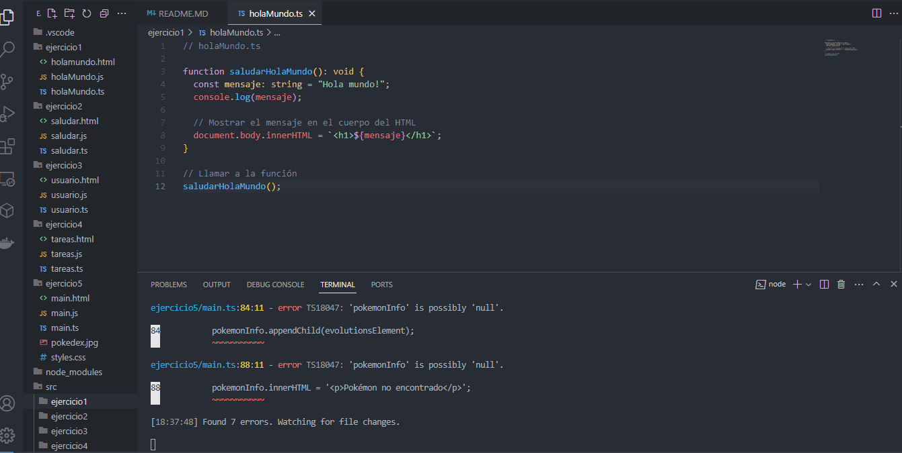
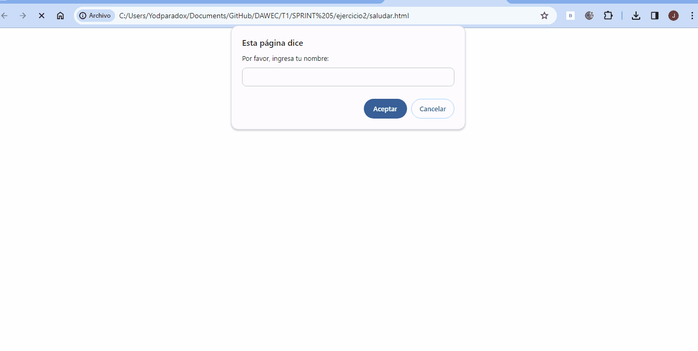
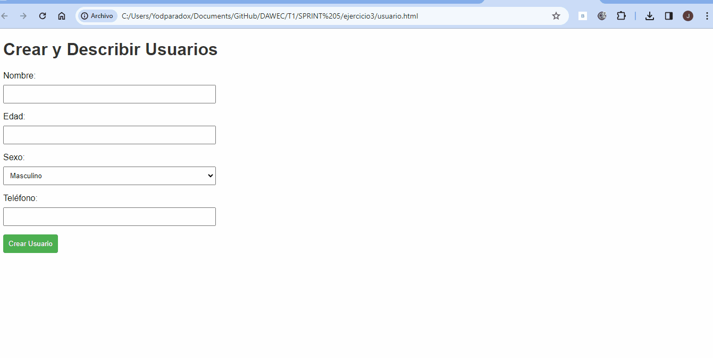
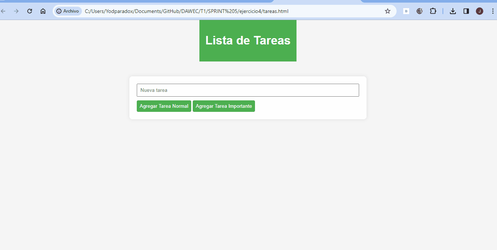
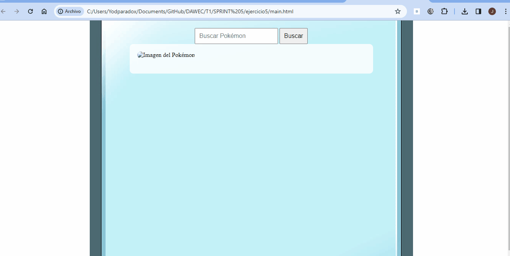

## Analizar las dieferencias entre javaScript y TypeScript

## Diferencias entre JavaScript y TypeScript

1.**Tipado:**
   -**JavaScript:** Lenguaje de tipado dinámico.
   -**TypeScript:** Lenguaje de tipado estático.

2.**Compilación:**
   -**JavaScript:** Interpretado directamente.
   -**TypeScript:** Requiere un paso de compilación.

3.**Extensiones de tipo:**
   -**JavaScript:** No tiene un sistema de tipos incorporado.
   -**TypeScript:** Agrega un sistema de tipos opcional.

4.**ECMAScript:**
   -**JavaScript:** Sigue las especificaciones de ECMAScript.
   -**TypeScript:** Superset de ECMAScript, con sus propias extensiones.

5.**Programación Orientada a Objetos:**
   -**JavaScript:** Admite POO, pero con limitaciones.
   -**TypeScript:** Ofrece un soporte mejorado para POO.

6.**Seguridad y Mantenibilidad:**
   -**JavaScript:** Errores de tipo en tiempo de ejecución.
   -**TypeScript:** Tipado estático para detectar errores en tiempo de compilación.

7.**Adopción y Comunidad:**
   -**JavaScript:** Ampliamente adoptado, gran comunidad.
   -**TypeScript:** Base de usuarios creciente, beneficia de la comunidad de JavaScript.

En resumen, JavaScript es esencial para el desarrollo web, mientras que TypeScript proporciona herramientas adicionales, como el tipado estático, para mejorar la seguridad y mantenibilidad, especialmente en proyectos grandes.

# Configuración de TypeScript en Windows 10 con Visual Studio Code

## Requisitos Previos:

1.**Node.js y npm:**

- Descarga e instala [Node.js y npm](https://nodejs.org/).
- Verifica la instalación ejecutando los siguientes comandos en la terminal:
  ```bash
  node -v
  npm -v
  ```

2.**Visual Studio Code:**

- Descarga e instala [Visual Studio Code](https://code.visualstudio.com/).

## Instalación de TypeScript y Configuración del Proyecto:

1.**Instala TypeScript globalmente:**

```bash
   npm install -g typescript
```

2. **Crea un nuevo directorio para tu proyecto y navega a él:**

   <pre><div class="bg-black rounded-md"><div class="flex items-center relative text-gray-200 bg-gray-800 gizmo:dark:bg-token-surface-primary px-4 py-2 text-xs font-sans justify-between rounded-t-md"><span>bash</span><button class="flex ml-auto gizmo:ml-0 gap-1 items-center"><svg width="24" height="24" viewBox="0 0 24 24" fill="none" xmlns="http://www.w3.org/2000/svg" class="icon-sm"><path fill-rule="evenodd" clip-rule="evenodd" d="M12 4C10.8954 4 10 4.89543 10 6H14C14 4.89543 13.1046 4 12 4ZM8.53513 4C9.22675 2.8044 10.5194 2 12 2C13.4806 2 14.7733 2.8044 15.4649 4H17C18.6569 4 20 5.34315 20 7V19C20 20.6569 18.6569 22 17 22H7C5.34315 22 4 20.6569 4 19V7C4 5.34315 5.34315 4 7 4H8.53513ZM8 6H7C6.44772 6 6 6.44772 6 7V19C6 19.5523 6.44772 20 7 20H17C17.5523 20 18 19.5523 18 19V7C18 6.44772 17.5523 6 17 6H16C16 7.10457 15.1046 8 14 8H10C8.89543 8 8 7.10457 8 6Z" fill="currentColor"></path></svg>Copy code</button></div><div class="p-4 overflow-y-auto"><code class="!whitespace-pre hljs language-bash">mkdir MiProyecto
   cd MiProyecto
   </code></div></div></pre>
3. **Inicializa un proyecto de npm (esto creará un archivo `package.json`):**

   <pre><div class="bg-black rounded-md"><div class="flex items-center relative text-gray-200 bg-gray-800 gizmo:dark:bg-token-surface-primary px-4 py-2 text-xs font-sans justify-between rounded-t-md"><span>bash</span><button class="flex ml-auto gizmo:ml-0 gap-1 items-center"><svg width="24" height="24" viewBox="0 0 24 24" fill="none" xmlns="http://www.w3.org/2000/svg" class="icon-sm"><path fill-rule="evenodd" clip-rule="evenodd" d="M12 4C10.8954 4 10 4.89543 10 6H14C14 4.89543 13.1046 4 12 4ZM8.53513 4C9.22675 2.8044 10.5194 2 12 2C13.4806 2 14.7733 2.8044 15.4649 4H17C18.6569 4 20 5.34315 20 7V19C20 20.6569 18.6569 22 17 22H7C5.34315 22 4 20.6569 4 19V7C4 5.34315 5.34315 4 7 4H8.53513ZM8 6H7C6.44772 6 6 6.44772 6 7V19C6 19.5523 6.44772 20 7 20H17C17.5523 20 18 19.5523 18 19V7C18 6.44772 17.5523 6 17 6H16C16 7.10457 15.1046 8 14 8H10C8.89543 8 8 7.10457 8 6Z" fill="currentColor"></path></svg>Copy code</button></div><div class="p-4 overflow-y-auto"><code class="!whitespace-pre hljs language-bash">npm init -y
   </code></div></div></pre>
4. **Instala TypeScript localmente:**

   <pre><div class="bg-black rounded-md"><div class="flex items-center relative text-gray-200 bg-gray-800 gizmo:dark:bg-token-surface-primary px-4 py-2 text-xs font-sans justify-between rounded-t-md"><span>bash</span><button class="flex ml-auto gizmo:ml-0 gap-1 items-center"><svg width="24" height="24" viewBox="0 0 24 24" fill="none" xmlns="http://www.w3.org/2000/svg" class="icon-sm"><path fill-rule="evenodd" clip-rule="evenodd" d="M12 4C10.8954 4 10 4.89543 10 6H14C14 4.89543 13.1046 4 12 4ZM8.53513 4C9.22675 2.8044 10.5194 2 12 2C13.4806 2 14.7733 2.8044 15.4649 4H17C18.6569 4 20 5.34315 20 7V19C20 20.6569 18.6569 22 17 22H7C5.34315 22 4 20.6569 4 19V7C4 5.34315 5.34315 4 7 4H8.53513ZM8 6H7C6.44772 6 6 6.44772 6 7V19C6 19.5523 6.44772 20 7 20H17C17.5523 20 18 19.5523 18 19V7C18 6.44772 17.5523 6 17 6H16C16 7.10457 15.1046 8 14 8H10C8.89543 8 8 7.10457 8 6Z" fill="currentColor"></path></svg>Copy code</button></div><div class="p-4 overflow-y-auto"><code class="!whitespace-pre hljs language-bash">npm install typescript --save-dev
   </code></div></div></pre>
5. **Crea un archivo de configuración de TypeScript (`tsconfig.json`):**

   <pre><div class="bg-black rounded-md"><div class="flex items-center relative text-gray-200 bg-gray-800 gizmo:dark:bg-token-surface-primary px-4 py-2 text-xs font-sans justify-between rounded-t-md"><span>bash</span><button class="flex ml-auto gizmo:ml-0 gap-1 items-center"><svg width="24" height="24" viewBox="0 0 24 24" fill="none" xmlns="http://www.w3.org/2000/svg" class="icon-sm"><path fill-rule="evenodd" clip-rule="evenodd" d="M12 4C10.8954 4 10 4.89543 10 6H14C14 4.89543 13.1046 4 12 4ZM8.53513 4C9.22675 2.8044 10.5194 2 12 2C13.4806 2 14.7733 2.8044 15.4649 4H17C18.6569 4 20 5.34315 20 7V19C20 20.6569 18.6569 22 17 22H7C5.34315 22 4 20.6569 4 19V7C4 5.34315 5.34315 4 7 4H8.53513ZM8 6H7C6.44772 6 6 6.44772 6 7V19C6 19.5523 6.44772 20 7 20H17C17.5523 20 18 19.5523 18 19V7C18 6.44772 17.5523 6 17 6H16C16 7.10457 15.1046 8 14 8H10C8.89543 8 8 7.10457 8 6Z" fill="currentColor"></path></svg>Copy code</button></div><div class="p-4 overflow-y-auto"><code class="!whitespace-pre hljs language-bash">npx tsc --init
   </code></div></div></pre>

   Este comando generará un archivo `tsconfig.json` con opciones de configuración. Puedes ajustar estas opciones según tus necesidades.

## Configuración de Visual Studio Code para Automatizar la Transpilación:

1. **Instala la extensión de TypeScript en Visual Studio Code:**
   * Abre Visual Studio Code.
   * Ve a la pestaña de extensiones (icono de cuadro en la barra lateral o `Ctrl+Shift+X`).
   * Busca "TypeScript" y selecciona la extensión proporcionada por Microsoft.
2. **Configura Visual Studio Code para la compilación automática:**
   * Abre tu proyecto en Visual Studio Code.
   * Crea un archivo llamado `.vscode/tasks.json` y añade el siguiente contenido:
     <pre><div class="bg-black rounded-md"><div class="flex items-center relative text-gray-200 bg-gray-800 gizmo:dark:bg-token-surface-primary px-4 py-2 text-xs font-sans justify-between rounded-t-md"><span>json</span><button class="flex ml-auto gizmo:ml-0 gap-1 items-center"><svg width="24" height="24" viewBox="0 0 24 24" fill="none" xmlns="http://www.w3.org/2000/svg" class="icon-sm"><path fill-rule="evenodd" clip-rule="evenodd" d="M12 4C10.8954 4 10 4.89543 10 6H14C14 4.89543 13.1046 4 12 4ZM8.53513 4C9.22675 2.8044 10.5194 2 12 2C13.4806 2 14.7733 2.8044 15.4649 4H17C18.6569 4 20 5.34315 20 7V19C20 20.6569 18.6569 22 17 22H7C5.34315 22 4 20.6569 4 19V7C4 5.34315 5.34315 4 7 4H8.53513ZM8 6H7C6.44772 6 6 6.44772 6 7V19C6 19.5523 6.44772 20 7 20H17C17.5523 20 18 19.5523 18 19V7C18 6.44772 17.5523 6 17 6H16C16 7.10457 15.1046 8 14 8H10C8.89543 8 8 7.10457 8 6Z" fill="currentColor"></path></svg>Copy code</button></div><div class="p-4 overflow-y-auto"><code class="!whitespace-pre hljs language-json">{
       "version": "2.0.0",
       "tasks": [
         {
           "label": "tsc: build - tsconfig.json",
           "command": "tsc",
           "args": ["-p", "."],
           "group": {
             "kind": "build",
             "isDefault": true
           },
           "problemMatcher": "$tsc"
         }
       ]
     }
     </code></div></div></pre>
   * Este archivo configura una tarea que ejecutará la compilación de TypeScript automáticamente.
3. **Configura el monitoreo de cambios para la transpilación automática:**
   * Abre tu proyecto en Visual Studio Code.
   * Crea un archivo llamado `.vscode/settings.json` y añade el siguiente contenido:
     <pre><div class="bg-black rounded-md"><div class="flex items-center relative text-gray-200 bg-gray-800 gizmo:dark:bg-token-surface-primary px-4 py-2 text-xs font-sans justify-between rounded-t-md"><span>json</span><button class="flex ml-auto gizmo:ml-0 gap-1 items-center"><svg width="24" height="24" viewBox="0 0 24 24" fill="none" xmlns="http://www.w3.org/2000/svg" class="icon-sm"><path fill-rule="evenodd" clip-rule="evenodd" d="M12 4C10.8954 4 10 4.89543 10 6H14C14 4.89543 13.1046 4 12 4ZM8.53513 4C9.22675 2.8044 10.5194 2 12 2C13.4806 2 14.7733 2.8044 15.4649 4H17C18.6569 4 20 5.34315 20 7V19C20 20.6569 18.6569 22 17 22H7C5.34315 22 4 20.6569 4 19V7C4 5.34315 5.34315 4 7 4H8.53513ZM8 6H7C6.44772 6 6 6.44772 6 7V19C6 19.5523 6.44772 20 7 20H17C17.5523 20 18 19.5523 18 19V7C18 6.44772 17.5523 6 17 6H16C16 7.10457 15.1046 8 14 8H10C8.89543 8 8 7.10457 8 6Z" fill="currentColor"></path></svg>Copy code</button></div><div class="p-4 overflow-y-auto"><code class="!whitespace-pre hljs language-json">{
       "tsc.autoDetect": "on"
     }
     </code></div></div></pre>
   * Esto habilita la detección automática de cambios y activa la transpilación cuando se guardan los archivos TypeScript.

## Uso:

Ahora, cuando guardes un archivo TypeScript, Visual Studio Code debería compilar automáticamente los cambios. También puedes ejecutar manualmente la tarea "tsc: build - tsconfig.json" desde la paleta de comandos (`Ctrl+Shift+P` y selecciona "Run Task") para compilar tu proyecto.

Esta guía proporciona una configuración básica. Puedes ajustar la configuración según tus necesidades específicas.

# Fases de Resolución de Problemas

## Ejercicio 1: Saludo en TypeScript

### Análisis del Problema

Se desea imprimir en la consola el saludo "Hola Mundo!" en TypeScript. El problema es simple y autocontenido.

### Diseño de la Propuesta de Solución

Se diseñará un script en TypeScript que imprima el saludo en la consola.

### Implementación del Diseño Propuesto

Se implementará el diseño establecido en el punto anterior.

## Ejercicio 2: Saludo Personalizado

### Análisis del Problema

Se busca solicitar al usuario que introduzca su nombre y edad, luego imprimir un saludo personalizado.

### Diseño de la Propuesta de Solución

Se diseñará un script en TypeScript que solicite nombre y edad, y luego imprima el saludo personalizado.

### Implementación del Diseño Propuesto

Se implementará el diseño establecido en el punto anterior.

## Ejercicio 3: Usuarios

### Análisis del Problema

Se requiere instanciar un array de usuarios e imprimir información sobre cada uno.

### Diseño de la Propuesta de Solución

Se diseñará un script en TypeScript que cree un array de usuarios y presente información sobre cada uno.

### Implementación del Diseño Propuesto

Se implementará el diseño establecido en el punto anterior.

## Ejercicio 4: Lista de Tareas

### Análisis del Problema

Se plantea gestionar una lista de tareas, añadiendo, eliminando y marcando tareas como importantes.

### Diseño de la Propuesta de Solución

Se diseñará un script en TypeScript que implemente las operaciones de gestión de la lista de tareas.

### Implementación del Diseño Propuesto

Se implementará el diseño establecido en el punto anterior.

## Ejercicio 5: Pokedex con PokeAPI

### Análisis del Problema

Se propone crear una Pokedex utilizando la PokeAPI para mostrar información de Pokémon.

### Diseño de la Propuesta de Solución

Se diseñará un script en TypeScript que interactúe con la PokeAPI y presente información detallada sobre Pokémon.

### Implementación del Diseño Propuesto

Se implementará el diseño establecido en el punto anterior.

## Ejercicio1:



Ejercicio2:



Ejercicio3:



Ejercicio 4:




Ejercicio5:


