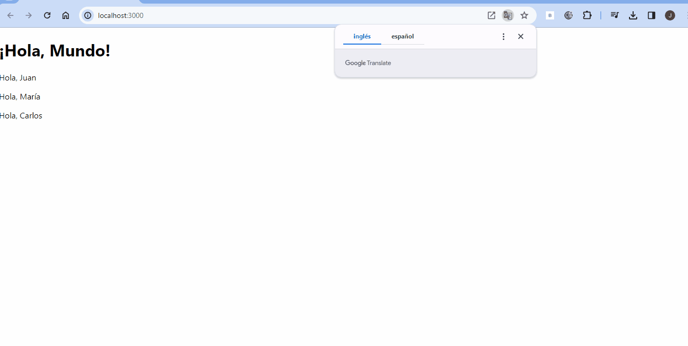
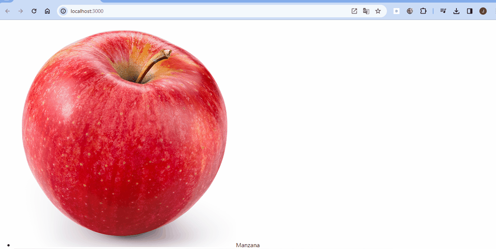
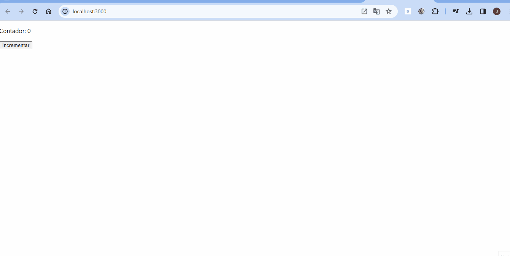
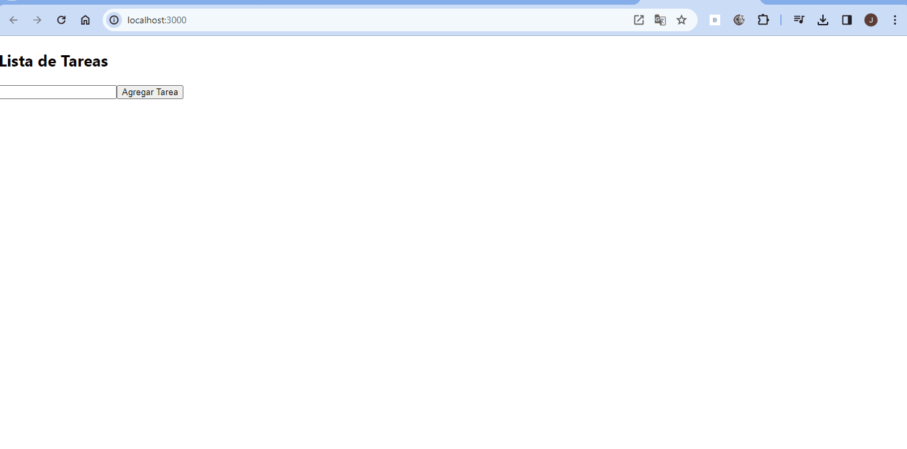
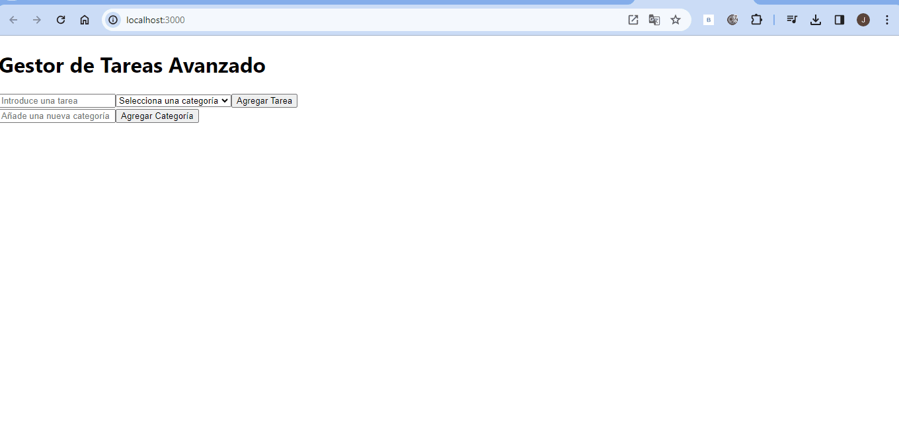

**React:**

*Ventajas:*
1.**Flexibilidad:** React es más una biblioteca que un marco, lo que brinda flexibilidad para elegir otras bibliotecas según las necesidades del proyecto.
2.**Virtual DOM:** Utiliza un Virtual DOM para mejorar el rendimiento, ya que solo actualiza las partes modificadas de la interfaz de usuario en lugar de toda la página.
3.**Gran Comunidad:** React cuenta con una amplia comunidad de desarrolladores, lo que facilita encontrar soluciones a problemas comunes y acceder a recursos útiles.

*Desventajas:*
1.**Curva de Aprendizaje:** Puede haber una curva de aprendizaje, especialmente para aquellos nuevos en el paradigma de programación de componentes.
2.**Decisiones a tomar:** Al ser más una biblioteca, puede requerir que tomes decisiones adicionales sobre herramientas y bibliotecas para el enrutamiento, manejo de estado, etc.

**Angular:**

*Ventajas:*
1.**Framework Completo:** Angular es un marco completo que proporciona muchas herramientas y funcionalidades incorporadas, lo que facilita el desarrollo rápido y consistente.
2.**Tipado:** Angular utiliza TypeScript, lo que proporciona un sistema de tipos estático, ayudando a evitar errores en tiempo de ejecución.
3.**Inyección de Dependencias:** Ofrece un sistema de inyección de dependencias que facilita la prueba unitaria y la modularidad del código.

*Desventajas:*
1.**Complejidad:** La complejidad de Angular puede ser abrumadora para proyectos pequeños o para desarrolladores nuevos.
2.**Tamaño:** Las aplicaciones Angular pueden tener un tamaño de archivo más grande en comparación con las construidas con otras tecnologías, lo que puede afectar el tiempo de carga.

**Elección entre React y Angular:**

**Usar React cuando:**
1.**Proyectos Pequeños o Medianos:** React es una excelente opción para proyectos más pequeños o medianos, ya que ofrece flexibilidad y no impone una estructura rígida.
2.**Integración Gradual:** Si deseas introducir gradualmente componentes de React en una aplicación existente, es más fácil hacerlo con React debido a su naturaleza incremental.
3.**Equipo con Experiencia en JavaScript:** Si tu equipo ya está familiarizado con JavaScript, especialmente con ES6 y JSX, aprender React puede ser más sencillo.

**Usar Angular cuando:**
1.**Aplicaciones Empresariales Complejas:** Para aplicaciones empresariales complejas que requieren un conjunto completo de herramientas y funcionalidades integradas, Angular es una opción sólida.
2.**Desarrollo Rápido y Consistente:** Angular proporciona un marco completo con decisiones de diseño predefinidas, lo que puede acelerar el desarrollo y mantener la consistencia en proyectos grandes.
3.**Aplicaciones de Misión Crítica:** Si estás construyendo una aplicación de misión crítica que requiere un fuerte sistema de tipado y rendimiento optimizado, Angular, con TypeScript, puede ser la elección preferida.

**Consideraciones Generales:**
1.**Comunidad y Soporte:** Ambas tecnologías tienen comunidades activas, pero React tiende a ser más popular. Si la comunidad y el soporte son cruciales para tu proyecto, esto podría ser un factor a tener en cuenta.
2.**Flexibilidad vs. Opinión:** React ofrece más flexibilidad, mientras que Angular proporciona una estructura más opinativa. La elección depende de tus preferencias y requisitos del proyecto.

# Fases de Resolución de Problemas

## Ejercicio 1: Hola Mundo en React y Componente con Props

### Análisis del Problema

El objetivo es crear un componente funcional llamado HolaMundo que renderice un elemento **`<h1>`** con el texto "¡Hola, Mundo!". Además, se debe crear un componente Saludo que acepte una prop nombre y renderice un párrafo con el saludo personalizado.

### Diseño de la Propuesta de Solución

Se diseñarán dos componentes: HolaMundo y Saludo. HolaMundo renderizará el saludo general, y Saludo tomará un nombre como prop para renderizar un saludo personalizado.

### Implementación del Diseño Propuesto

Se implementarán los componentes HolaMundo y Saludo de acuerdo con el diseño propuesto.

## Ejercicio 2: Lista de Elementos

### Análisis del Problema

Se requiere crear un componente ListaDeFrutas que renderice una lista de frutas, aceptando un array de frutas como prop.

### Diseño de la Propuesta de Solución

Se diseñará el componente ListaDeFrutas, que tomará un array de frutas y renderizará una lista de elementos con las imágenes de las frutas.

### Implementación del Diseño Propuesto

Se implementará el componente ListaDeFrutas de acuerdo con el diseño propuesto.

## Ejercicio 3: Contador de Clicks

### Análisis del Problema

Se debe crear un componente Contador que muestre un número y un botón, incrementando el número con cada clic.

### Diseño de la Propuesta de Solución

Se diseñará el componente Contador utilizando el hook useState para gestionar el estado del número.

### Implementación del Diseño Propuesto

Se implementará el componente Contador según el diseño propuesto.

## Ejercicio 4: Aplicación de Tareas

### Análisis del Problema

Crear una aplicación de lista de tareas (ToDoApp) que permita añadir, completar y eliminar tareas.

### Diseño de la Propuesta de Solución

Diseñar una interfaz que incluya un campo de texto para nuevas tareas, una lista de tareas con checkbox para completar y botón para eliminar. Gestionar el estado con useState.

### Implementación del Diseño Propuesto

Implementar la aplicación ToDoApp siguiendo el diseño propuesto.

## Ejercicio 5: Gestor de Tareas con Estados Complejos y Local Storage

### Análisis del Problema

Desarrollar una aplicación avanzada de gestión de tareas en React que permita categorizar, filtrar y persistir datos en Local Storage.

### Diseño de la Propuesta de Solución

Diseñar una interfaz que permita categorizar tareas, filtrar por categoría o estado, y utilizar Local Storage para persistencia.

### Implementación del Diseño Propuesto

## Ejercicio 1:

## Ejercicio 2:

## Ejercicio 3:

## Ejercicio 4:

## Ejercicio 5:

