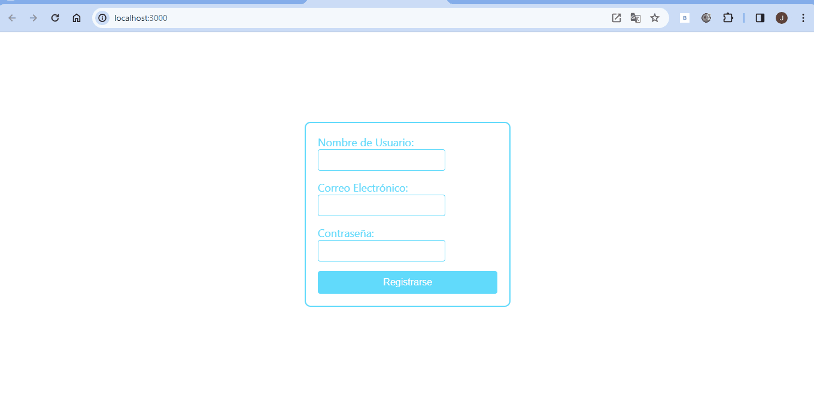
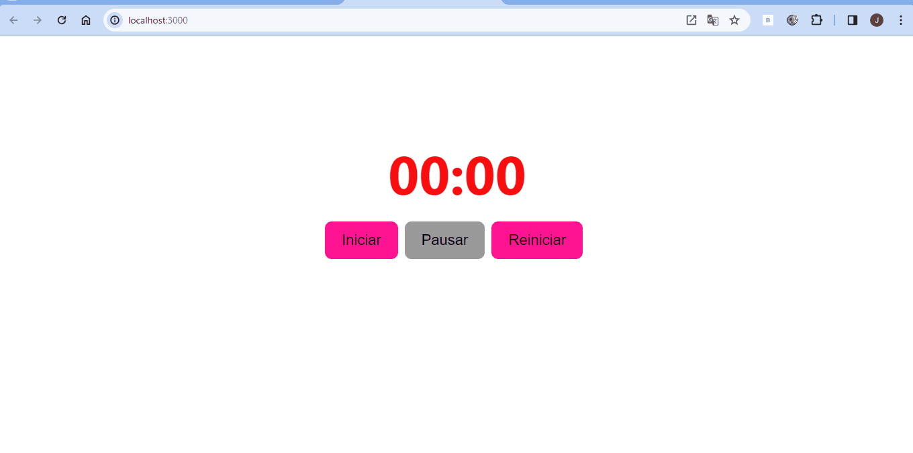
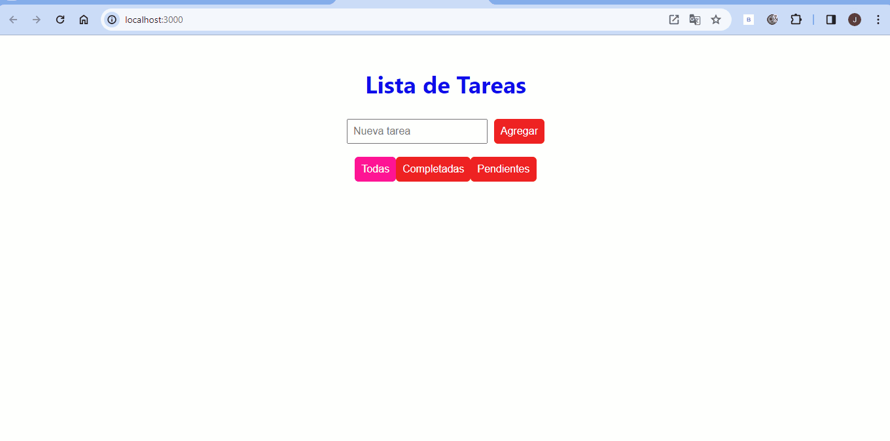

# Ejercicios de Desarrollo de Aplicaciones Web y Clientes Web Avanzadas

Este repositorio contiene las soluciones a los ejercicios de la asignatura de Desarrollo de Aplicaciones Web y Clientes Web Avanzadas.

## Ejercicio 1: Formulario de Registro con Validación

### Análisis del Problema

El objetivo es crear un formulario de registro con validación de campos como nombre de usuario, correo electrónico y contraseña.

### Diseño de la Propuesta de Solución del Problema

1. Crear un componente de clase `FormularioRegistro` con estado para manejar los valores de los campos y los mensajes de error.
2. Implementar métodos para manejar cambios en los campos, validar datos y mostrar mensajes de error.
3. Establecer estilos condicionales para los campos inválidos.
4. Renderizar el formulario en `App` y realizar pruebas de validación.

## Ejercicio 2: Cronómetro con Inicio, Pausa y Reinicio

### Análisis del Problema

Desarrollar un cronómetro con botones para iniciar, pausar y reiniciar el tiempo.

### Diseño de la Propuesta de Solución del Problema

1. Crear un componente de clase `Cronometro` con estado para el tiempo y el estado de actividad.
2. Implementar métodos para iniciar, pausar y reiniciar el cronómetro.
3. Limpiar el intervalo en `componentWillUnmount`.
4. Renderizar el cronómetro en `App` y realizar pruebas de funcionalidad.

## Ejercicio 3: Aplicación de Tareas con Filtrado y Almacenamiento Local

### Análisis del Problema

Desarrollar una aplicación de tareas con funcionalidades como añadir, eliminar, filtrar y marcar tareas.

### Diseño de la Propuesta de Solución del Problema

1. Crear un componente de clase `AppTareas` con estado para las tareas, filtro y términos de búsqueda.
2. Implementar funcionalidades para añadir, eliminar, filtrar y marcar tareas.
3. Utilizar `componentDidMount` para cargar tareas almacenadas y `componentDidUpdate` para actualizar el almacenamiento local.
4. Renderizar la aplicación en `App` y realizar pruebas de funcionalidad.

## Ejercicio 4: Galería de Imágenes con Carga Asíncrona y Modal

### Análisis del Problema

Crear una galería de imágenes que cargue imágenes de una API, las muestre en un grid y permita abrir una imagen en un modal.

### Diseño de la Propuesta de Solución del Problema

1. Crear un componente de clase `GaleriaImagenes` con estado para las imágenes y la imagen seleccionada.
2. Implementar la carga de imágenes desde una API y el funcionamiento del modal.
3. Renderizar la galería en `App` y realizar pruebas de carga de imágenes y funcionalidad del modal.

## Ejercicio 5: Galería de Imágenes con Carga Asíncrona, Modal y Funcionalidades Avanzadas

### Análisis del Problema

Desarrollar una galería de imágenes avanzada con funcionalidades como paginación, búsqueda y navegación en el modal.

### Diseño de la Propuesta de Solución del Problema

1. Crear un componente de clase `GaleriaImagenesAvanzada` con estado para las imágenes, términos de búsqueda, página actual y imagen seleccionada.
2. Implementar la carga de imágenes, paginación, búsqueda y funcionamiento del modal.
3. Renderizar la galería en `App` y realizar pruebas de todas las funcionalidades.

## Ejercicio1:

## Ejercicio2:

## Ejercicio3:

## Ejercicio4:

## Ejercicio5:

