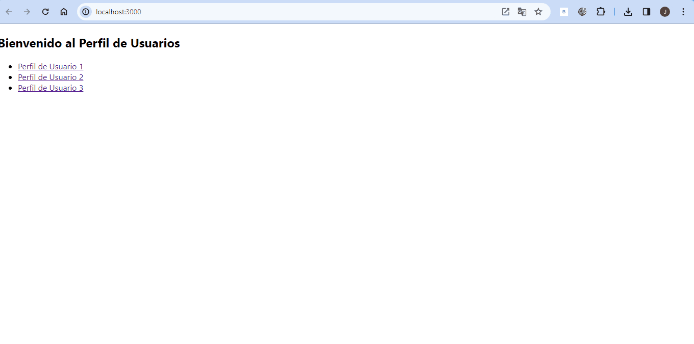
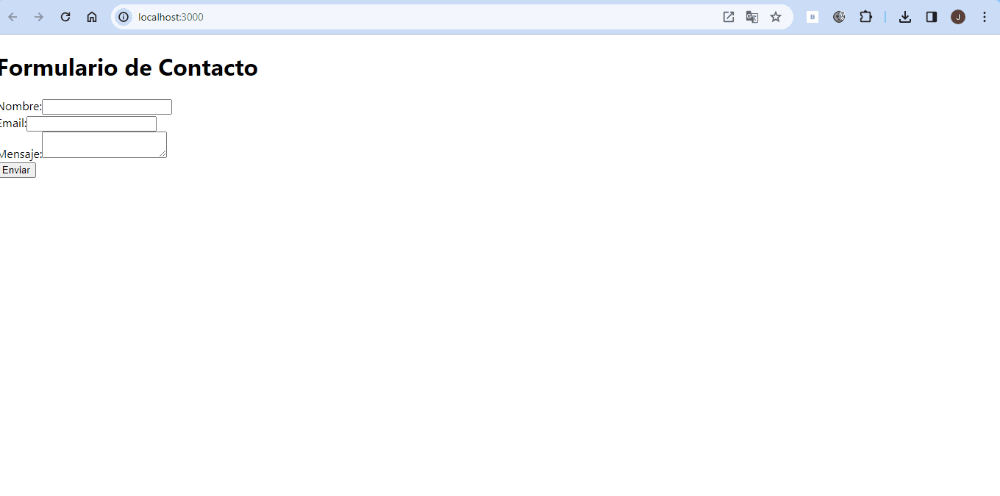
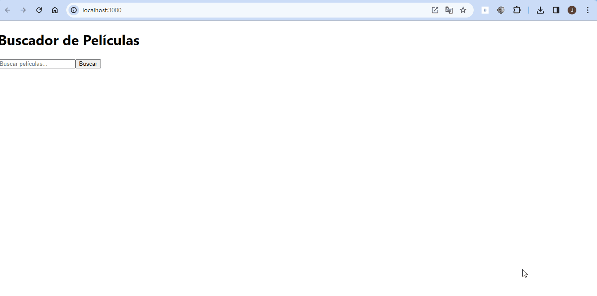
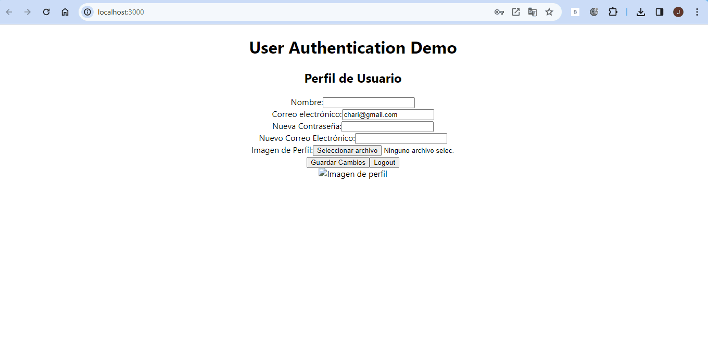

# Solución al Problema de Perfiles de Usuario con React Router

## Análisis del Problema

Este proyecto tiene como objetivo crear una aplicación simple de perfil de usuario utilizando React Router para la navegación. Cada perfil de usuario tendrá su propia URL basada en el ID del usuario.

## Diseño de la Propuesta de Solución del Problema

1.**Configuración de React Router**:

- Asegurarse de que React Router esté instalado utilizando `npm install react-router-dom`.
- Envolver el componente App con `<BrowserRouter>` en el punto de entrada de la aplicación.

2.**Creación de Componentes**:

- Crear dos componentes: `Inicio` y `PerfilUsuario`.
  - El componente `Inicio` mostrará un mensaje de bienvenida y enlaces a perfiles de usuario ficticios.
  - El componente `PerfilUsuario` extraerá el ID del usuario de los parámetros de ruta y mostrará un mensaje simple como "Perfil del Usuario: [ID]".

3.**Configuración de las Rutas**:

- Configurar las rutas en el componente `App` utilizando `<Switch>` y `<Route>`.
  - Habrá una ruta para el componente `Inicio` (por ejemplo, `/`) y otra para `PerfilUsuario` (por ejemplo, `/usuario/:id`).

4.**Navegación Utilizando `<Link>`**:

- En el componente `Inicio`, crear enlaces (`<Link>`) que dirijan al usuario a diferentes perfiles, modificando el ID en la URL.

5.**Extracción de Parámetros de Ruta en `PerfilUsuario`**:

- Utilizar `useParams` en `PerfilUsuario` para obtener el ID del usuario de la URL y mostrarlo en la página.

## Ejercicio 1: Navegación con Parámetros de Ruta

**Objetivo**:
Crear una aplicación simple de perfil de usuario que utilice React Router para la navegación, donde cada perfil tenga su propia URL basada en el ID del usuario.

**Tareas**:

1. Configurar React Router en la aplicación.
2. Crear dos componentes: `Inicio` y `PerfilUsuario`.
3. Configurar las rutas en el componente `App`.
4. Usar `<Link>` para la navegación en el componente `Inicio`.
5. Utilizar `useParams` para extraer parámetros de ruta en `PerfilUsuario`.

# Gestión de Formularios y Validaciones con React Hook Form

## Análisis del Problema

El objetivo de este ejercicio es crear un formulario de contacto simple que valide la entrada del usuario antes de mostrar un mensaje de éxito. Para lograr esto, se utilizará React Hook Form para gestionar el estado del formulario y las validaciones de entrada.

## Diseño de la Propuesta de Solución del Problema

1.**Instalación de React Hook Form**:

- Ejecutar `npm install react-hook-form` para añadir React Hook Form al proyecto.

2.**Creación del Componente `FormularioContacto`**:

- Este componente contendrá un formulario con campos para el nombre, email y mensaje.
- Se utilizará `useForm` de React Hook Form para gestionar el estado del formulario.

3.**Validación de los Campos del Formulario**:

- Se agregarán validaciones a los campos del formulario utilizando las opciones de validación de React Hook Form.
- Todos los campos serán requeridos y se aplicará una validación específica para el campo de email para garantizar un formato de correo electrónico válido.

4.**Mensajes de Error para Validaciones Fallidas**:

- Se mostrarán mensajes de error debajo de cada campo si no pasa la validación, utilizando elementos HTML como ``.

5.**Manejo del Envío del Formulario**:

- En el evento `onSubmit`, se mostrará un mensaje de alerta que indique "Formulario enviado con éxito" si el formulario es válido.

6.**Integración del Componente `FormularioContacto`**:

- Se asegurará de que el componente `FormularioContacto` se muestre correctamente en la aplicación.

## Ejercicio 2: Gestión de Formularios y Validaciones con React Hook Form

**Objetivo**:
Crear un formulario de contacto simple que valide la entrada del usuario antes de mostrar un mensaje de éxito, utilizando React Hook Form.

**Tareas**:

1. Instalar React Hook Form ejecutando `npm install react-hook-form`.
2. Crear un componente `FormularioContacto` con un formulario que contenga campos para nombre, email y mensaje.
3. Agregar validaciones a los campos del formulario, incluyendo requerimientos y validación específica para el campo de email.
4. Mostrar mensajes de error debajo de cada campo si no pasa la validación.
5. Manejar el envío del formulario y mostrar un mensaje de éxito si el formulario es válido.

# Buscador de Películas con API Externa

## Análisis del Problema

El objetivo de este ejercicio es crear una aplicación que permita a los usuarios buscar películas por nombre utilizando la API de OMDB (Open Movie Database) y mostrar los resultados en la página.

## Diseño de la Propuesta de Solución del Problema

1.**Configuración Inicial**:

- Obtener una API key gratuita registrándose en OMDB API.
- Crear un nuevo componente llamado `BuscadorPeliculas`.

2.**Creación del Formulario de Búsqueda**:

- Incluir un input de texto para el término de búsqueda y un botón para enviar la búsqueda.
- Manejar el estado del término de búsqueda en el componente.

3.**Realizar la Petición a la API de OMDB**:

- Utilizar `fetch` para realizar una petición a la API de OMDB cuando el usuario envíe el formulario.
- Usar el término de búsqueda del estado para buscar películas por nombre.
- Ejemplo de URL de petición: `https://www.omdbapi.com/?s={termino_de_busqueda}&apikey={tu_api_key}`.

4.**Mostrar Resultados de Búsqueda**:

- Almacenar los resultados de la búsqueda en el estado del componente.
- Mostrar una lista de películas que coincidan con el término de búsqueda. Cada elemento de la lista debe incluir al menos el título de la película y el año de lanzamiento.

5.**Manejo de Errores y Estados de Carga**:

- Implementar un indicador de carga que se muestre mientras se está realizando la petición a la API.
- Mostrar mensajes adecuados en caso de que la búsqueda no arroje resultados o si ocurre un error en la petición.

## Ejercicio 3: Buscador de Películas con API Externa

**Objetivo**:
Crear una aplicación que permita a los usuarios buscar películas por nombre usando la API de OMDB (Open Movie Database) y mostrar los resultados en la página.

**Tareas**:

1. Obtener una API key gratuita registrándose en OMDB API.
2. Crear un nuevo componente llamado `BuscadorPeliculas`.
3. Crear un formulario de búsqueda con un input de texto y un botón.
4. Realizar una petición a la API de OMDB utilizando fetch cuando el usuario envíe el formulario.
5. Mostrar los resultados de la búsqueda en la página, incluyendo título de la película y año de lanzamiento.
6. Implementar un indicador de carga y mostrar mensajes de error adecuados.

# Actualización de Perfil de Usuario con Autenticación

## Análisis del Problema

El objetivo de este ejercicio es crear una aplicación que permita a los usuarios registrarse, iniciar sesión y actualizar su perfil, incluyendo la carga de una imagen de perfil, interactuando con una API que requiere autenticación.

## Diseño de la Propuesta de Solución del Problema

1.**Configuración Inicial y Elección de API**:

- Utilizar una API que ofrezca autenticación y operaciones de perfil de usuario, como Firebase Auth para la autenticación y Cloud Storage para las imágenes. En caso de preferir una alternativa, se puede simular las operaciones con JSON Placeholder y agregar autenticación ficticia.

2.**Implementación de Autenticación**:

- Crear componentes para el registro y el inicio de sesión de usuarios.
- Implementar la lógica de autenticación utilizando la API seleccionada, gestionando tokens JWT u otro mecanismo de autenticación proporcionado por la API.

3.**Interfaz de Usuario para el Perfil**:

- Desarrollar un componente `PerfilUsuario` donde los usuarios puedan ver y editar su información de perfil, incluido el nombre, correo electrónico y la imagen de perfil.
- Asegurarse de que solo los usuarios autenticados puedan acceder a esta página.

4.**Carga y Actualización de la Imagen de Perfil**:

- Incorporar un formulario en el componente `PerfilUsuario` que permita a los usuarios subir o cambiar su imagen de perfil.
- Utilizar la API para subir la imagen al servidor o almacenamiento en la nube y actualizar la URL de la imagen en el perfil del usuario.

5.**Actualización de Datos del Perfil**:

- Permitir a los usuarios modificar su información de perfil (nombre, correo electrónico) a través de un formulario.
- Al enviar el formulario, realizar una petición PUT o PATCH a la API para actualizar la información en el servidor, asegurándose de que la solicitud incluya la autenticación del usuario.

6.**Manejo de Sesiones y Protección de Rutas**:

- Implementar el manejo de sesiones para mantener a los usuarios conectados.
- Proteger las rutas relacionadas con el perfil de usuario para asegurar que solo los usuarios autenticados puedan acceder a ellas.

## Ejercicio 4: Actualización de Perfil de Usuario con Autenticación

**Objetivo**:
Crear una aplicación que permita a los usuarios registrarse, iniciar sesión y actualizar su perfil, incluyendo la carga de una imagen de perfil, interactuando con una API que requiere autenticación.

**Tareas**:

1. Configurar una API que ofrezca autenticación y operaciones de perfil de usuario.
2. Implementar componentes para el registro y el inicio de sesión de usuarios.
3. Desarrollar un componente `PerfilUsuario` donde los usuarios puedan ver y editar su información de perfil.
4. Permitir a los usuarios cargar y actualizar su imagen de perfil.
5. Implementar manejo de sesiones y protección de rutas para asegurar la autenticación de los usuarios.

## Ejercicio 1:

## Ejercicio 2:

## Ejercicio 3:

## Ejercicio 4:

